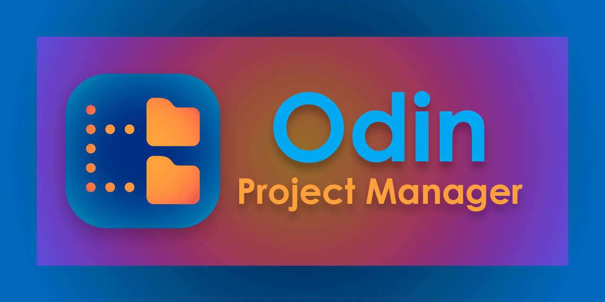

.. Odin documentation master file, created by
   sphinx-quickstart on Thu Jul 22 13:10:10 2021.
   You can adapt this file completely to your liking, but it should at least
   contain the root `toctree` directive.

********************************
Welcome to Odin's documentation!
********************************

Introduction
============

Odin is a project manager for 3D production.
It can be used by freelance artist or school project.

It allows the user to:

* Create a project:
    * Add assets:
        * Characters
        * Props/Static
        * Sets/Environment
        * FX
    * Add sequences
    * Add shots relatives to a sequence
* Choose an existing project
* Run multiple software with a python environment

.. note:: Check out the [:ref:`Change configuration <change_config>`] section for further information.

Installation
============

- Download the latest :release:`release <>`
- Unzip the file
- Put the Odin folder wherever you want
- Run `Odin.exe`

.. toctree::
   :titlesonly:
   :hidden:

   usage.md
   sources.md
